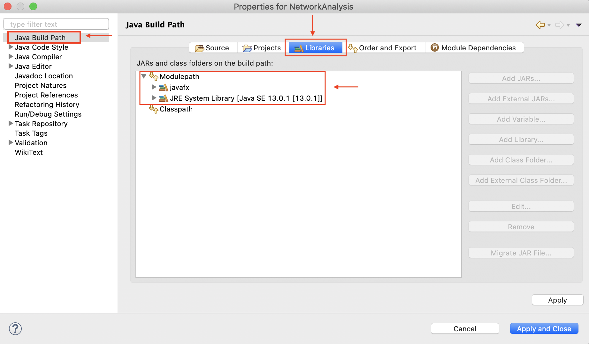

# Network Analysis

## Instructions for installation using *Java SE 13.0.1*, *JavaFX 13.0.1* and *Eclipse* [**Modular from IDE!!!**]

For other development environment, please modify this tutorial accordingly.

> Notice: The version of Java SE and JavaFX has been updated to *13.0.2* since *14/01/2020*, but they are compatible each other.

1. Download [Java SE 13.0.1](https://www.oracle.com/technetwork/java/javase/downloads/index.html) as the principal platform to run the project.

2. Download [JavaFX 13.0.1](https://gluonhq.com/products/javafx/).

3. **Eclipse** could be used to open the archive file (*NetworkAnalysis.zip*), but before that, several steps need to be done firstly.
   * Open the preferences settings of Eclipse (hotkey: “CMD + ,” on macOS).

   * Locate “Java -> Build Path -> User Libraries” and click New… to add new user-defined libraries, name it as “javafx” as followed:

   

   * After creating the user-defined library, click “Add External JARs…”.

   

   * From the local path of the downloaded JavaFX sdk, import all the *.jar files.

   

   * The imported packages are displayed like the following, and click “Apply and Close”:

   

4. Follow the next few steps to import the archive (.zip) file as a project into Eclipse.
   * “File -> Import…”

   

   * Choose “Existing Projects into Workspace”

   

   * Select archive file and check if the project exists, leave other parameters as default and “Finish”.

   

5. Double check the Liberaries in Java Build Path to ensure all libraries are correctly applied.

   * Right click the root of the project, and choose "Properties" (hotkey: CMD + l on macOS).

   

   * Choose "Java Build Path -> Libraries" to check if all libraries hava been included. There should be two libraries under Modulepath, one javafx as an external library to create GUI and another major JRE System Library (in this case, any JavaSE-13 version)

   

6. Set "Run Configuration" to make sure the project could run properly.

   * Right click “NetworkAnalysis” and select “Run Configurations…” to create a profile for “Java Application” (just double click) and name it as “NetworkAnalysis”.

   
   

   * Click “Search…” to select the Main class of the project and select “Main – home”. Alternatively, just type "home.Main" in the textfield.

   
   

   * Go to “Arguments” tab and make sure to uncheck “Use the -XstartOnFirstThread argument when launching with SWT”. (It seems this checkbox only exists on macOS)

   

7. Finally, run the project. The Input file “PPInetwork.txt” is under the root folder, and another "PPInetwork_copy.txt" is a modified version, deleting some connections, to view the differences.

### Hints!

* The following extension (*e(fx)clipse 3.6.0*) could be helpful to have a better view of .fxml and .css files.

* For any trouble running this project, contact the author immediately throughout mail: hanyi.mo@postgrad.manchester.ac.uk